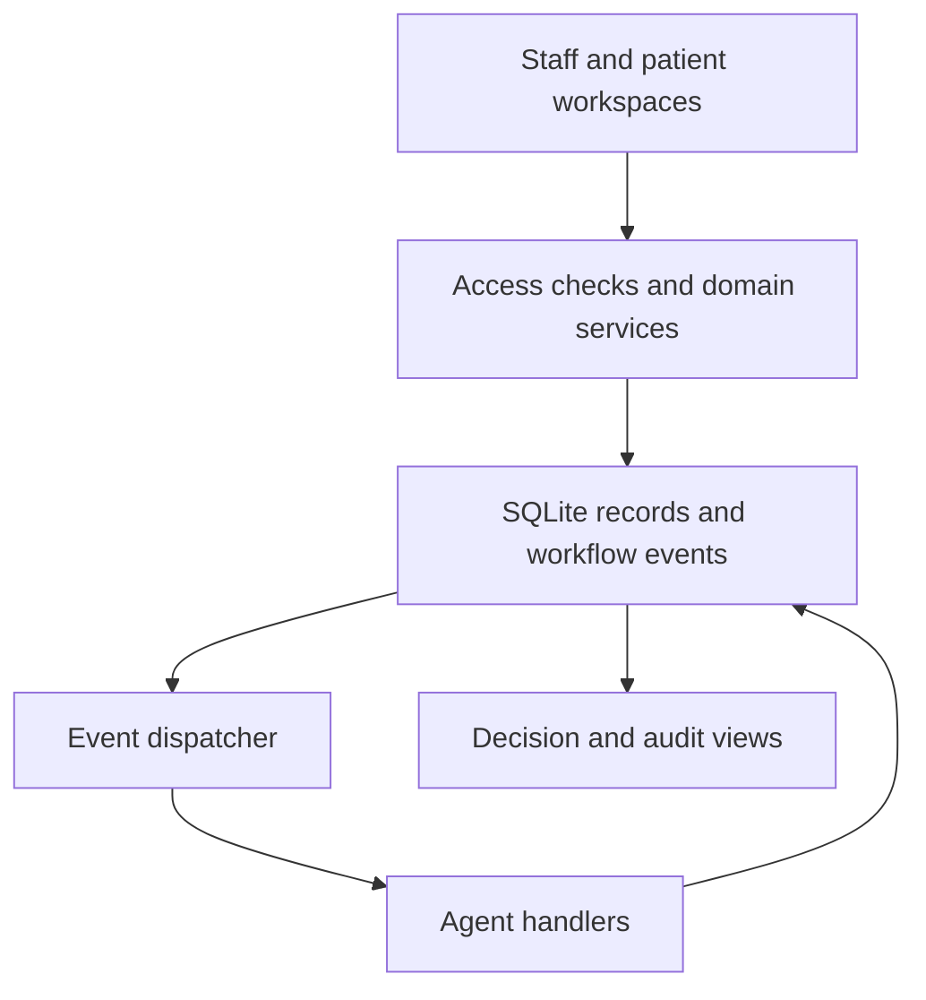

# MedAgent Sync

[](https://github.com/Olatomii/MEDAGENT/actions/workflows/tests.yml)

An agent-based hospital appointment and patient management prototype built with
Python, Streamlit and SQLite. It connects booking capacity, patient arrivals,
care transitions and waitlist allocation through recorded workflow events.

[Open the hosted application](https://medagent-jdzd.onrender.com/)

## Explore the project

The public introduction includes a workflow walkthrough without requiring an
account. Patient and staff records require sign-in. A fresh deployment may need
the owner to complete administrator setup before accounts can be used.
There are no shared administrator credentials.

Use fictional records only. This is a software engineering prototype, not a
clinical decision system. Triage thresholds have not been clinically validated.
The free hosted application uses temporary storage: records and accounts may
reset on restart or redeployment. Live email delivery is disabled. An unattended
worker and persistent hosting are not deployed.

## What it does

- Patient registration, generated patient IDs, patient invitations and a scoped portal.
- Role-based staff access enforced at the application boundary.
- Daily doctor sessions, booking, cancellations, rescheduling and waitlist promotion.
- Check-in, structured vital signs, consultation, diagnostics, pharmacy and ward workflows.
- Availability, leave and breaks, plus consultation start and finish tracking.
- Transactional capacity allocation and version checks against stale care actions.
- Recorded workflow events, agent decisions and staff audit activity.
- Manual database backup/restore and reproducible synthetic queue-policy evaluation.

Consultations have no fixed duration. Routine session capacity is a booking quota;
emergency capacity represents concurrent places. A completed routine visit does
not automatically create another booking place.

## How the agents work

The agents are deterministic event handlers in one Python application, not
independent services or a machine-learning model. Domain services validate actions
and persist events alongside state changes. A synchronous dispatcher processes
pending events and records decision reasons.

| Component | Responsibility |
| --- | --- |
| Waitlist agent | Allocates released capacity by urgency and waiting order |
| Appointment agent | Records reasons for booking and appointment changes |
| Care coordination agent | Records visit transition decisions |
| Clinical support handler | Attributes vitals, ward, availability and related events to their workflow agents |



Each event's database effects, decisions and completion marker commit together.
Failed handlers leave the event pending for investigation and recovery. These
guarantees do not imply exactly-once delivery to an external email provider.

## Run locally

Use Python 3.12. From a terminal:

```sh
git clone https://github.com/Olatomii/MEDAGENT.git
cd MEDAGENT
python -m venv .venv
```

Activate the environment with `source .venv/bin/activate` on macOS/Linux or
`.venv\Scripts\Activate.ps1` in Windows PowerShell, then:

```sh
python -m pip install -r requirements-dev.txt
python -m hospital.manage --database medagent_v2.db create-staff administrator --role admin
python -m streamlit run app_v2.py
```

The account command prompts privately for a password. Do not put credentials in
source files or command arguments. SQLite is initialized automatically.

When deploying through `app.py`, set `MEDAGENT_APP_VERSION=v2`. The v2 database
path is controlled by `MEDAGENT_V2_DB_PATH` and defaults to `medagent_v2.db`.
Browser-based initial setup requires a privately provisioned `MEDAGENT_SETUP_TOKEN`.
Removing the version setting selects the legacy application; it does not migrate data.

## Try a complete journey

1. Sign in as the local administrator. Under **Doctor sessions**, give a doctor capacity for today.
2. Under **Patients**, create a fictional patient. Book their department under **Appointments**.
3. Record routine billing clearance, then check in. Billing clearance records a staff decision; it does not process payment.
4. In **Care workspace**, record assessment and follow the permitted consultation and care transitions.
5. Fill a session and book another patient to create a waitlist entry. Cancel an unstarted confirmed booking.
6. Inspect the resulting promotion and its explanation in **Agent decisions**.

Configure ward capacity before testing admission. Staff control clinical actions;
the system does not diagnose patients or arrange real-world transfers.

## Tests

```sh
python -m pytest -q
```

GitHub Actions runs the suite on pull requests and pushes to the main and preview
branches. Tests cover scheduling, capacity, access control, care transitions,
patient workflows, reminders, operational recovery and Streamlit screens.
Tests use temporary databases and mocked delivery; no email credentials are needed.

## Code map and further reading

| Path | Purpose |
| --- | --- |
| `app_v2.py` | Authenticated Streamlit application |
| `hospital/` | Domain services, storage, agents, access control and supporting UI |
| `app.py` | Deployment selector and legacy application |
| `tests/` | Domain and interface regression tests |
| [FOUNDATION.md](FOUNDATION.md) | Data model, event handling and capacity semantics |
| [STAFF_ACCESS.md](STAFF_ACCESS.md) | Account setup, roles and enforcement boundaries |
| [PATIENT_EXPERIENCE.md](PATIENT_EXPERIENCE.md) | Registration, duplicate review and patient experience |
| [INTEGRATION.md](INTEGRATION.md) | Care workflows and reminder integration |
| [OPERATIONS.md](OPERATIONS.md) | Operational tools, backup and evaluation |

Persistent storage, verified reminder delivery, external audit retention and
clinical/security validation remain future work. No reuse license has been
selected for this repository yet.
